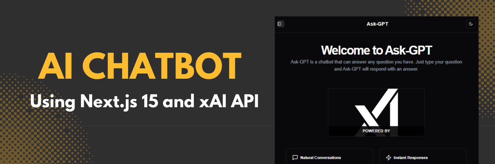

<div align="center">
  <br />
    <a href="https://youtu.be/v00Ly3-JD6k" target="_blank">
      
    </a>
  <br />

  <div>
    
    
    
    
    
  </div>

  <h3 align="center">Ask-GPT - AI Chatbot</h3>

<div align="center">
     Build this project step by step with a detailed tutorial on <a href="https://www.youtube.com/@codespirit369/videos" target="_blank"><b>Code Spirit</b></a> YouTube. 
    </div>
</div>

## 📋 <a name="table">Table of Contents</a>

1. 🎬 [Introduction](#introduction)
2. ⚙️ [Tech Stack](#tech-stack)
3. 🔋 [Features](#features)
4. 🚀 [Quick Start](#quick-start)

## 🚨 Tutorial

This repository contains the code corresponding to an in-depth tutorial available on our YouTube channel, <a href="https://www.youtube.com/@codespirit369/videos" target="_blank"><b>Code Spirit</b></a>.

<a href="https://youtu.be/s1u7tJ9VUh0" target="_blank"></a>

## <a name="tech-stack">⚙️ Tech Stack</a>

- Next.js 15
- React 19 RC
- Typescript
- TailwindCSS
- shadcn/ui
- Firebase
- xAI grok-beta

## <a name="introduction">🎬 Introduction</a>

In this tutorial, we’ll build an AI chatbot from scratch using Next.js 15, React 19 RC, and xAI’s grok-beta model. This project features a sleek UI with tailwindcss and shadcn/ui components, theme toggling with next-themes, and real-time chat history stored in Firebase Firestore. We’ll also set up secure authentication with next-auth. By the end of the tutorial, you’ll have a modern, fully functional chatbot.

## <a name="features">🔋 Features</a>

👉 **AI-Powered Responses**: Using xAI's Grok-beta model, generate accurate, context-aware responses, bringing a real-time conversational AI experience.

👉 **Real-time Chat History**: View and manage all previous chats with timestamps, powered by Firebase Firestore for persistent storage.

👉 **Auth.js Authentication with GitHub**: Secure user authentication using GitHub as the provider, allowing for user-specific chat storage and personalization.

👉 **Dark/Light Theme Toggle**: Theme toggling functionality with next-themes, providing a customizable dark/light mode UI for a better user experience

## <a name="quick-start">🚀 Quick Start</a>

Follow these steps to set up the project locally on your machine.

**Prerequisites**

Make sure you have the following installed on your machine:

- [Git](https://git-scm.com/)
- [Node.js](https://nodejs.org/en)
- [npm](https://www.npmjs.com/) (Node Package Manager)

**Cloning the Repository**

```bash
git clone https://github.com/code-spirit-369/ask-gpt.git
cd ask-gpt
```

**Installation**

Install the project dependencies using npm:

```bash
bun install
```

**Set Up Environment Variables**

Create a new file named `.env.local` in the root of your project and add the following content:

```env
AUTH_SECRET=
AUTH_GITHUB_ID=
AUTH_GITHUB_SECRET=

XAI_API_KEY=

FIREBASE_SERVICE_ACCOUNT_KEY=
```

Get your xAI API key from [xAI](https://x.ai/).<br/>

**Running the Project**

```bash
bun dev
```

Open [http://localhost:3000](http://localhost:3000) in your browser to view the project.
